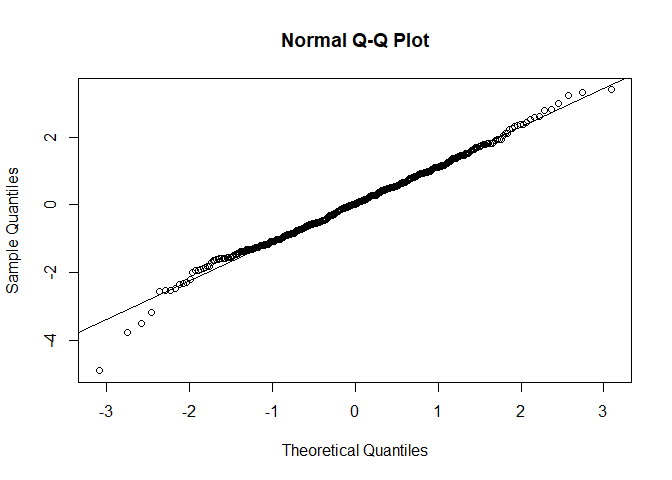

Validation
================

After fitting the model and calculating its coefficients, it is
necessary to verify that the coefficients of the fitted model are
significant and that the residuals meet the assumptions of normality,
randomness, and independence.

### Signficance of the parameters

It is verified that all coefficients are significant:

``` r
coeftest(m1)
```

    ## 
    ## z test of coefficients:
    ## 
    ##       Estimate Std. Error  z value  Pr(>|z|)    
    ## ma1  -0.751320   0.044532 -16.8714 < 2.2e-16 ***
    ## ma2  -0.143031   0.050175  -2.8506  0.004363 ** 
    ## ma4  -0.102805   0.036514  -2.8155  0.004870 ** 
    ## sar1 -0.848415   0.037973 -22.3426 < 2.2e-16 ***
    ## sar2  0.897519   0.056310  15.9388 < 2.2e-16 ***
    ## sar3  0.950863   0.039071  24.3367 < 2.2e-16 ***
    ## sma1  0.915714   0.086762  10.5543 < 2.2e-16 ***
    ## sma2 -0.882564   0.064076 -13.7736 < 2.2e-16 ***
    ## sma3 -0.986982   0.075485 -13.0753 < 2.2e-16 ***
    ## ---
    ## Signif. codes:  0 '***' 0.001 '**' 0.01 '*' 0.05 '.' 0.1 ' ' 1

It is verified that all coefficients are significant at both the 0.05
and 0.01 confidence levels.

### Normality of the residuals

To test the normality of the residuals, the Kolmogorov-Smirnov test is
used, given that the sample contains more than 50 observations:

``` r
ks.test(residuals(m1), "pnorm", mean = mean(residuals(m1)), sd = sd(residuals(m1)))
```

    ## 
    ##  Asymptotic one-sample Kolmogorov-Smirnov test
    ## 
    ## data:  residuals(m1)
    ## D = 0.027109, p-value = 0.8593
    ## alternative hypothesis: two-sided

Under the hypothesis of normality, there is strong evidence (p-valor =
0.8593) not to reject the normality hypothesis of the residuals. After
examining the QQ-plot of the residuals, the same conclusion is reached,
as the points are quite close to the line.

``` r
qqnorm(residuals(m1))
qqline(m1$residuals)
```

<!-- -->

### Independence of the residuals

The Ljung-Box test is conducted to verify that the residuals are
independent:

``` r
Box.test(residuals(m1), type = "Ljung-Box", lag = 24, fitdf = 9)
```

    ## 
    ##  Box-Ljung test
    ## 
    ## data:  residuals(m1)
    ## X-squared = 21.262, df = 15, p-value = 0.1287

As observed, there is no evidence to reject the hypothesis of
independence, so the residuals of the model are independent of each
other (p-valor = 0.1287).

### Randomness of the residuals

Finally, the runs test is used to check the randomness of the residuals.

``` r
runs.test(as.factor(m1$residuals > median(m1$residuals)))
```

    ## 
    ##  Runs Test
    ## 
    ## data:  as.factor(m1$residuals > median(m1$residuals))
    ## Standard Normal = -0.089893, p-value = 0.9284
    ## alternative hypothesis: two.sided

As observed, there is strong evidence to accept the hypothesis of
randomness of the residuals (p-valor = 0.9284).
