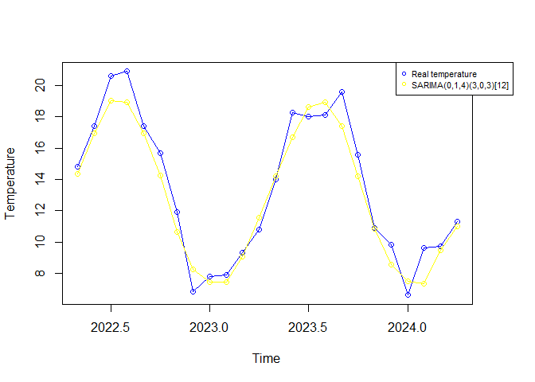

Forecast
================
Natalia Lazareva
2024-08-28

After verifying that all necessary assumptions are met and confirming
that the fitted model is optimal, the key step in the model fitting
process is carried out: the prediction of future values. In this case,
the prediction is made for the next two years (from May 2022 to April
2024).

``` r
(pred <- forecast(m1, h = 24))
```

    ##          Point Forecast     Lo 80     Hi 80     Lo 95     Hi 95
    ## May 2022      14.339151 12.845943 15.832358 12.055487 16.622815
    ## Jun 2022      16.935709 15.395564 18.475854 14.580261 19.291157
    ## Jul 2022      19.025695 17.476736 20.574655 16.656766 21.394624
    ## Aug 2022      18.920977 17.363194 20.478759 16.538554 21.303399
    ## Sep 2022      16.967686 15.409898 18.525475 14.585254 19.350118
    ## Oct 2022      14.268632 12.710829 15.826435 11.886178 16.651086
    ## Nov 2022      10.623858  9.066040 12.181675  8.241381 13.006334
    ## Dec 2022       8.221880  6.664037  9.779723  5.839364 10.604396
    ## Jan 2023       7.434967  5.877068  8.992866  5.052366  9.817567
    ## Feb 2023       7.440378  5.882474  8.998283  5.057769  9.822988
    ## Mar 2023       9.074741  7.516830 10.632651  6.692122 11.457359
    ## Apr 2023      11.572420 10.014504 13.130336  9.189793 13.955047
    ## May 2023      14.185110 12.623562 15.746659 11.796929 16.573292
    ## Jun 2023      16.703162 15.141231 18.265093 14.314395 19.091929
    ## Jul 2023      18.608584 17.046530 20.170638 16.219629 20.997539
    ## Aug 2023      18.928522 17.366346 20.490699 16.539380 21.317665
    ## Sep 2023      17.422614 15.860430 18.984797 15.033461 19.811766
    ## Oct 2023      14.206016 12.643785 15.768246 11.816791 16.595241
    ## Nov 2023      10.862953  9.300675 12.425231  8.473655 13.252251
    ## Dec 2023       8.560593  6.998252 10.122935  6.171198 10.949988
    ## Jan 2024       7.496035  5.934339  9.057731  5.107627  9.884443
    ## Feb 2024       7.337072  5.775369  8.898774  4.948654  9.725490
    ## Mar 2024       9.459948  7.898239 11.021657  7.071520 11.848375
    ## Apr 2024      11.007851  9.446136 12.569566  8.619414 13.396289

``` r
plot(pred)
```

<!-- -->

The pred() function returns the point forecast and the upper and lower
bands for 80% and 95% confidence intervals. The table and the plot above
show a comparison between the values predicted by the model and the
actual temperature values for this month.

| Period (month-year) | Mean observed temperature (in ºC) | Mean estimated temperature (in ºC) |
|---------------------|-----------------------------------|------------------------------------|
| 05-2022             | 14.8                              | 14.3                               |
| 06-2022             | 17.4                              | 16.9                               |
| 07-2022             | 20.6                              | 19.0                               |
| 08-2022             | 20.9                              | 18.9                               |
| 09-2022             | 17.4                              | 17.0                               |
| 10-2022             | 15.7                              | 14.3                               |
| 11-2022             | 11.9                              | 10.6                               |
| 12-2022             | 6.8                               | 8.2                                |
| 01-2023             | 7.8                               | 7.4                                |
| 02-2023             | 7.9                               | 7.4                                |
| 03-2023             | 9.3                               | 9.1                                |
| 04-2023             | 10.8                              | 11.6                               |
| 05-2023             | 14.0                              | 14.2                               |
| 06-2023             | 18.3                              | 16.7                               |
| 07-2023             | 18.0                              | 19.0                               |
| 08-2023             | 18.1                              | 18.9                               |
| 09-2023             | 19.6                              | 17.0                               |
| 10-2023             | 15.6                              | 14.3                               |
| 11-2023             | 10.9                              | 10.6                               |
| 12-2023             | 9.8                               | 8.2                                |
| 01-2024             | 6.6                               | 7.5                                |
| 02-2024             | 9.6                               | 7.4                                |
| 03-2024             | 9.7                               | 9.1                                |
| 04-2024             | 11.3                              | 11.0                               |

``` r
# Set plot margins
par(mar=c(5.1, 4.1, 4.1, 4.1), xpd=TRUE)

# Plot real temperature data
plot(temperatura_real, type = "o", col = "blue", xlab = "Time", ylab = "Temperature")

# Add predicted temperature data
lines(pred$mean, type = "o", col = "yellow")

# Add legend
legend("topright", 
       legend = c("Real temperature", "SARIMA(0,1,4)(3,0,3)[12]"), 
       col = c("blue", "yellow"), 
       pch = c(1, 1), 
       cex = 0.7, 
       inset = c(-0.1, 0))  # Adjusted inset values for visibility
```

<!-- -->

However, the model *SARIMA(1,0,1) × (0,1,1)\[12\]* has also been
previously proposed as one of the possible options, although the
confidence interval of the *AR(1)* coefficient includes 1. The
prediction is made with this model for the same time period.

``` r
(pred1 <- forecast(modelo2, h = 24))
```

    ##          Point Forecast     Lo 80     Hi 80     Lo 95     Hi 95
    ## May 2022      14.010435 12.487936 15.532935 11.681973 16.338898
    ## Jun 2022      16.692104 15.138264 18.245944 14.315711 19.068497
    ## Jul 2022      18.616697 17.044276 20.189118 16.211886 21.021507
    ## Aug 2022      18.509336 16.925825 20.092848 16.087565 20.931108
    ## Sep 2022      16.927127 15.336971 18.517283 14.495193 19.359060
    ## Oct 2022      13.894442 12.300296 15.488587 11.456406 16.332477
    ## Nov 2022      10.383300  8.786756 11.979843  7.941597 12.825003
    ## Dec 2022       8.075434  6.477448  9.673420  5.631526 10.519342
    ## Jan 2023       7.061712  5.462904  8.660521  4.616545  9.506879
    ## Feb 2023       7.130945  5.531613  8.730277  4.684977  9.576913
    ## Mar 2023       8.846566  7.246918 10.446213  6.400116 11.293016
    ## Apr 2023      11.003855  9.404017 12.603693  8.557114 13.450595
    ## May 2023      13.688804 12.084526 15.293082 11.235273 16.142336
    ## Jun 2023      16.442446 14.837780 18.047111 13.988321 18.896570
    ## Jul 2023      18.422906 16.818007 20.027805 15.968424 20.877388
    ## Aug 2023      18.358911 16.753871 19.963951 15.904215 20.813608
    ## Sep 2023      16.810363 15.205239 18.415487 14.355538 19.265189
    ## Oct 2023      13.803807 12.198632 15.408981 11.348904 16.258709
    ## Nov 2023      10.312947  8.707743 11.918151  7.857999 12.767894
    ## Dec 2023       8.020824  6.415604  9.626045  5.565852 10.475797
    ## Jan 2024       7.019323  5.414138  8.624508  4.564405  9.474241
    ## Feb 2024       7.098041  5.492850  8.703233  4.643112  9.552970
    ## Mar 2024       8.821025  7.215829 10.426221  6.366090 11.275960
    ## Apr 2024      10.984030  9.378832 12.589228  8.529091 13.438968

``` r
plot(pred1)
```

<!-- -->

The following table is prepared to compare both predictions with the
observed temperatures:

| Period (month-year) | Mean observed temperature (en ºC) | SARIMA(0,1,4) × (3,0,3)\[12\] | SARIMA(1,0,1) × (0,1,1)\[12\] |
|---------------------|-----------------------------------|-------------------------------|-------------------------------|
| 05-2022             | 14.8                              | 14.3                          | 14.01                         |
| 06-2022             | 17.4                              | 16.9                          | 16.7                          |
| 07-2022             | 20.6                              | 19.0                          | 18.6                          |
| 08-2022             | 20.9                              | 18.9                          | 18.5                          |
| 09-2022             | 17.4                              | 17.0                          | 16.9                          |
| 10-2022             | 15.7                              | 14.3                          | 13.9                          |
| 11-2022             | 11.9                              | 10.6                          | 10.4                          |
| 12-2022             | 6.8                               | 8.2                           | 8.1                           |
| 01-2023             | 7.8                               | 7.4                           | 7.1                           |
| 02-2023             | 7.9                               | 7.4                           | 7.1                           |
| 03-2023             | 9.3                               | 9.1                           | 8.9                           |
| 04-2023             | 10.8                              | 11.6                          | 11.0                          |
| 05-2023             | 14.0                              | 14.2                          | 13.7                          |
| 06-2023             | 18.3                              | 16.7                          | 16.4                          |
| 07-2023             | 18.0                              | 19.0                          | 18.4                          |
| 08-2023             | 18.1                              | 18.9                          | 18.4                          |
| 09-2023             | 19.6                              | 17.0                          | 16.8                          |
| 10-2023             | 15.6                              | 14.3                          | 13.8                          |
| 11-2023             | 10.9                              | 10.6                          | 10.3                          |
| 12-2023             | 9.8                               | 8.2                           | 8.0                           |
| 01-2024             | 6.6                               | 7.5                           | 7.0                           |
| 02-2024             | 9.6                               | 7.4                           | 7.1                           |
| 03-2024             | 9.7                               | 9.1                           | 8.8                           |
| 04-2024             | 11.3                              | 11.0                          | 10.1                          |

In the end, the predicted values from both models are compared with the
actual data:

``` r
par(mar=c(5.1, 4.1, 4.1, 4.1), xpd=TRUE)

plot(temperatura_real, type = "o", col = "blue", xlab =
"Time", ylab = "Temperature")
lines(pred1$mean, type = "o", col = "red")
lines(pred$mean, type = "o", col = "yellow")
legend("topright", legend = c("Real temperature",
"SARIMA(0,1,4)(3,0,3)[12]", "SARIMA(1,0,1)(0,1,1)[12]"), 
col = c("blue", "red", "yellow"), inset = c(-0.1, 0),
pch=c(1,1), cex = 0.7)
```

<!-- -->

## Conslusions

In the present work, the chosen dataset for modeling, which consists of
the monthly average temperature data for Jersey Island, has been
introduced. The necessary steps for identifying the *SARIMA(0,1,4) ×
(3,0,3)\[12\]* model using the statistical software RStudio have been
detailed. The main objective of the modeling was to forecast the monthly
average temperature from May 2022 to April 2024. Considering the model’s
accuracy measures, it can be concluded that the predictions are quite
close to reality (*ME* = 0.02916225, *RMSE* = 1.132191, *MAE* =
0.8926147). The high precision of the predictions is also confirmed by
comparing them with the monthly average temperature measurements
provided by the island’s government, as well as with the predictions
made using the suboptimal *SARIMA(1,0,1) × (0,1,1)\[12\]* model. The
values estimated with the final model are closer to the actual
measurements than those made with the suboptimal model, although both
tend to underestimate the real temperature in most cases.
