Estimation
================

The second step of the modeling process involves estimating the
coefficients of the proposed model and, if necessary, modifying the
orders to achieve a valid model. For this reason, the Arima() function
is used to calculate the coefficients of the previously proposed
*SARIMA* model:

``` r
modelo <- Arima(temperatura, order = c(0,0,0), seasonal = list(order = c(0,1,1), period = 12), method='ML')
summary(modelo)
```

    ## Series: temperatura 
    ## ARIMA(0,0,0)(0,1,1)[12] 
    ## 
    ## Coefficients:
    ##          sma1
    ##       -0.8855
    ## s.e.   0.0243
    ## 
    ## sigma^2 = 1.556:  log likelihood = -802.42
    ## AIC=1608.84   AICc=1608.87   BIC=1617.21
    ## 
    ## Training set error measures:
    ##                     ME     RMSE       MAE        MPE     MAPE      MASE
    ## Training set 0.1977749 1.230857 0.9552022 -0.5556195 10.59417 0.7288631
    ##                   ACF1
    ## Training set 0.2462806

The residuals of the model with only one coefficient, *SMA(1)* =
−0.8855, do not exhibit the behavior of white noise, as some lags fall
outside the bands in the ACF and PACF plots. The extended
autocorrelation function of the model’s residuals suggests estimating
the model *SARIMA(1,0,1) × (0,1,1)\[12\]*.

``` r
eacf(residuals(modelo))
```

    ## AR/MA
    ##   0 1 2 3 4 5 6 7 8 9 10 11 12 13
    ## 0 x x o o o x o o o o o  o  o  o 
    ## 1 x o o o o o o o o o o  o  o  o 
    ## 2 x x o o o o o o o o o  o  o  o 
    ## 3 x x o o o o o o o o o  o  o  o 
    ## 4 x x x x o o o o o o o  o  o  o 
    ## 5 x x o x o o o o o o o  o  o  o 
    ## 6 x x o x x o o o o o o  o  o  o 
    ## 7 x x x x x o o o o o o  o  o  o

``` r
acf(residuals(modelo), lag.max = 60, ci.type='ma')
```

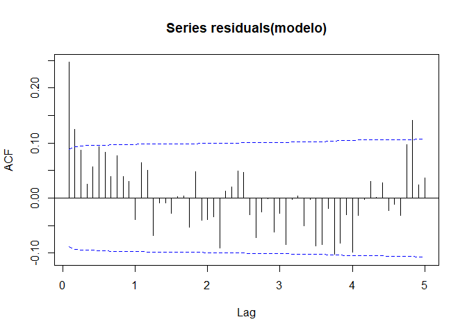<!-- -->

``` r
pacf(residuals(modelo), lag.max = 60)
```

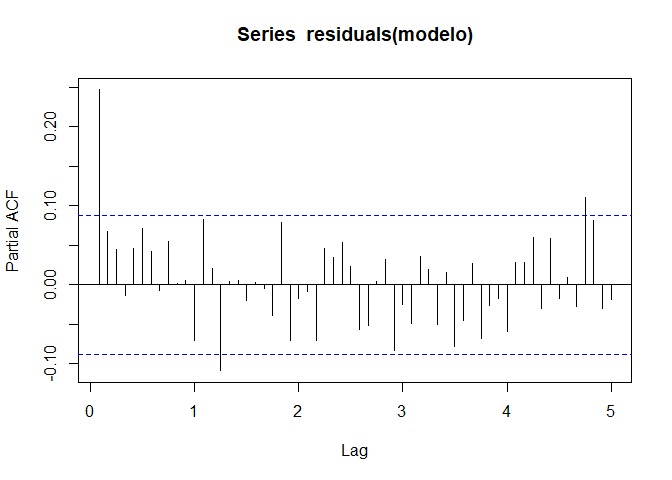<!-- -->

The parameters of the second proposed model, *SARIMA(1,0,1) ×
(0,1,1)\[12\]*, are estimated as follows:

``` r
modelo2 <- Arima(temperatura, order = c(1,0,1), seasonal = list(order = c(0,1,1), period = 12), method='ML')
summary(modelo2)
```

    ## Series: temperatura 
    ## ARIMA(1,0,1)(0,1,1)[12] 
    ## 
    ## Coefficients:
    ##          ar1      ma1     sma1
    ##       0.7762  -0.5723  -0.9347
    ## s.e.  0.1906   0.2532   0.0333
    ## 
    ## sigma^2 = 1.411:  log likelihood = -780.94
    ## AIC=1569.88   AICc=1569.97   BIC=1586.61
    ## 
    ## Training set error measures:
    ##                    ME    RMSE       MAE        MPE     MAPE      MASE
    ## Training set 0.139921 1.16962 0.9196444 -0.8845387 10.19225 0.7017309
    ##                    ACF1
    ## Training set 0.02327738

It is observed that the model’s coefficients have a rather high standard
error, and in the case of the *AR(1)* coefficient, its confidence
interval ±1.96√𝑠.𝑒. includes the value 1.

``` r
confint(modelo2)
```

    ##           2.5 %      97.5 %
    ## ar1   0.4026461  1.14980299
    ## ma1  -1.0684882 -0.07607428
    ## sma1 -1.0000507 -0.86933072

The ACF and PACF plots of the model’s residuals are visualized as
follows:

``` r
acf(residuals(modelo2), lag.max = 60, ci.type='ma')
```

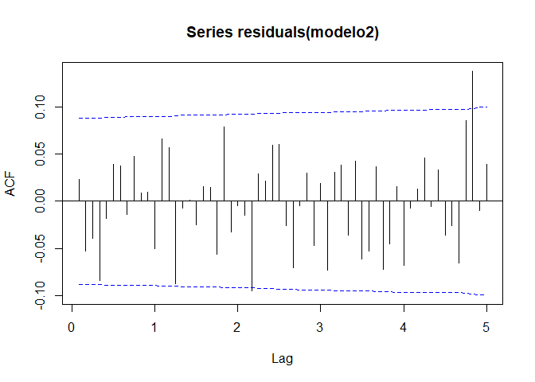<!-- -->

``` r
pacf(residuals(modelo2), lag.max = 60)
```

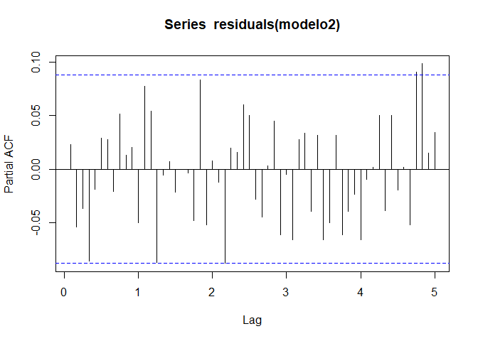<!-- -->

In this case, all correlations are within the bands (there are two lags
at the end that are outside the bands, which can be ignored), indicating
that this model might be optimal. However, considering the high errors
of the coefficients, this could reduce the accuracy of the predictions.
Consequently, since the confidence interval of the *AR(1)* coefficient
includes 1, it is proposed to differentiate the regular part of the
series and reduce the number of *AR* terms by one. Thus, the next model
to estimate would be *SARIMA(0,1,1) × (0,1,1)\[12\]*.

``` r
modelo3 <- Arima(temperatura, order = c(0,1,1), seasonal = list(order = c(0,1,1), period = 12), method='ML')
summary(modelo3)
```

    ## Series: temperatura 
    ## ARIMA(0,1,1)(0,1,1)[12] 
    ## 
    ## Coefficients:
    ##           ma1     sma1
    ##       -0.8811  -1.0000
    ## s.e.   0.0337   0.0401
    ## 
    ## sigma^2 = 1.391:  log likelihood = -787.34
    ## AIC=1580.67   AICc=1580.72   BIC=1593.21
    ## 
    ## Training set error measures:
    ##                       ME     RMSE      MAE       MPE     MAPE      MASE
    ## Training set 0.003066256 1.161402 0.918884 -1.953721 10.17764 0.7011507
    ##                   ACF1
    ## Training set 0.1380455

In the newly estimated model, the coefficient *SMA(1)* is equal to -1,
indicating that the model is over-differentiated. Therefore, the
seasonal order 𝐷 is removed, and the coefficient *SAR(1)* is added. The
new proposed model will be *SARIMA(0,1,1) × (1,0,1)\[12\]*.

``` r
modelo4 <- Arima(temperatura, order = c(0,1,1), seasonal = list(order = c(1,0,1), period = 12), method='ML')
summary(modelo4) 
```

    ## Series: temperatura 
    ## ARIMA(0,1,1)(1,0,1)[12] 
    ## 
    ## Coefficients:
    ##           ma1  sar1     sma1
    ##       -0.8866     1  -0.9868
    ## s.e.   0.0350     0   0.0137
    ## 
    ## sigma^2 = 1.411:  log likelihood = -821.8
    ## AIC=1651.6   AICc=1651.68   BIC=1668.41
    ## 
    ## Training set error measures:
    ##                      ME     RMSE       MAE       MPE     MAPE      MASE
    ## Training set 0.01330455 1.183037 0.9495345 -2.086338 10.50359 0.7245384
    ##                   ACF1
    ## Training set 0.1600526

However, when attempting to fit this model, the coefficient *SAR(1)* =
1, which may indicate the need to differentiate the seasonal part of the
model again and add one more order to the *SMA* part. Therefore, the
fifth hypothetical model will be *SARIMA(0,1,1) × (1,1,2)\[12\]*.

``` r
modelo5 <- Arima(temperatura, order = c(0,1,1), seasonal = list(order = c(1,1,2), period = 12), method='ML')
summary(modelo5)
```

    ## Series: temperatura 
    ## ARIMA(0,1,1)(1,1,2)[12] 
    ## 
    ## Coefficients:
    ##           ma1    sar1     sma1    sma2
    ##       -0.8803  0.0387  -1.0835  0.0835
    ## s.e.   0.0329  1.0616   1.0620  1.0608
    ## 
    ## sigma^2 = 1.391:  log likelihood = -786.87
    ## AIC=1583.74   AICc=1583.87   BIC=1604.64
    ## 
    ## Training set error measures:
    ##                       ME     RMSE       MAE       MPE     MAPE      MASE
    ## Training set 0.003883816 1.158903 0.9169513 -1.923677 10.14218 0.6996759
    ##                   ACF1
    ## Training set 0.1390003

The plots of the simple autocorrelation function and partial
autocorrelation function are visualized, and it is observed that in both
plots, there are several lags that fall outside the bands.

``` r
acf(residuals(modelo5), lag.max = 60, ci.type='ma')
```

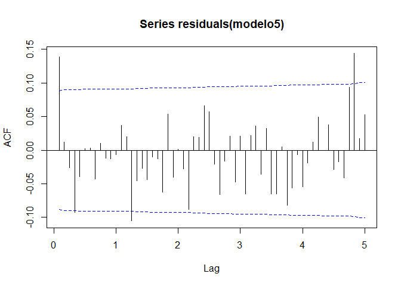<!-- -->

``` r
pacf(residuals(modelo5), lag.max = 60)
```

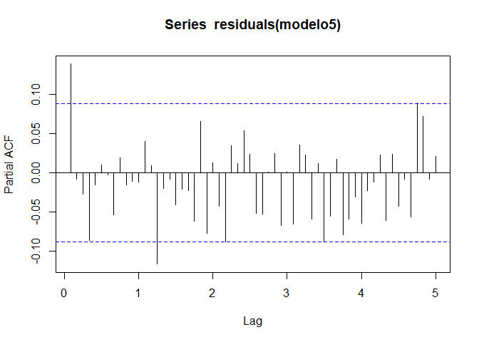<!-- -->

In particular, it is observed that in the ACF plot, lag 1 is outside the
bands, suggesting the addition of the coefficient *MA(2)* to the current
model. Thus, the coefficients of the model *SARIMA(0,1,2) ×
(1,1,2)\[12\]* are estimated.

``` r
modelo6 <- Arima(temperatura, order = c(0,1,2), seasonal = list(order = c(1,1,2), period = 12), method='ML')
summary(modelo6) 
```

    ## Series: temperatura 
    ## ARIMA(0,1,2)(1,1,2)[12] 
    ## 
    ## Coefficients:
    ##           ma1      ma2     sar1     sma1    sma2
    ##       -0.7609  -0.1692  -0.0018  -1.0399  0.0399
    ## s.e.   0.0441   0.0483   0.9021   0.9049  0.9032
    ## 
    ## sigma^2 = 1.354:  log likelihood = -780.48
    ## AIC=1572.97   AICc=1573.15   BIC=1598.05
    ## 
    ## Training set error measures:
    ##                       ME     RMSE       MAE      MPE     MAPE      MASE
    ## Training set 0.006536486 1.142411 0.8984064 -1.94175 10.01933 0.6855253
    ##                     ACF1
    ## Training set 0.009281451

However, noting that the standard errors of the seasonal coefficients
*SAR(1)*, *SMA(1)*, and *SMA(2)* are quite high, the need for seasonal
differentiation can be rejected, as the over-differentiation of the
model causes multicollinearity. The seventh model is adjusted with only
one differentiation in the regular part, which is *SARIMA(0,1,2) ×
(2,0,2)\[12\]*.

``` r
modelo7 <- Arima(temperatura, order = c(0,1,2), seasonal = list(order = c(2,0,2), period = 12), method='ML')
summary(modelo7)
```

    ## Series: temperatura 
    ## ARIMA(0,1,2)(2,0,2)[12] 
    ## 
    ## Coefficients:
    ##           ma1      ma2    sar1    sar2    sma1     sma2
    ##       -0.7705  -0.2268  0.0149  0.9850  0.0220  -0.9563
    ## s.e.   0.0413   0.0413  0.0742  0.0742  0.0757   0.0729
    ## 
    ## sigma^2 = 1.388:  log likelihood = -811.1
    ## AIC=1636.19   AICc=1636.42   BIC=1665.63
    ## 
    ## Training set error measures:
    ##                      ME     RMSE       MAE       MPE     MAPE      MASE
    ## Training set 0.02171799 1.169762 0.9269761 -2.196172 10.38163 0.7073253
    ##                    ACF1
    ## Training set 0.02535856

It is noted that the standard errors of the seasonal coefficients have
decreased drastically, but some lags are still outside the bands in the
ACF and PACF plots.

``` r
acf(residuals(modelo7), lag.max = 60, ci.type='ma')
```

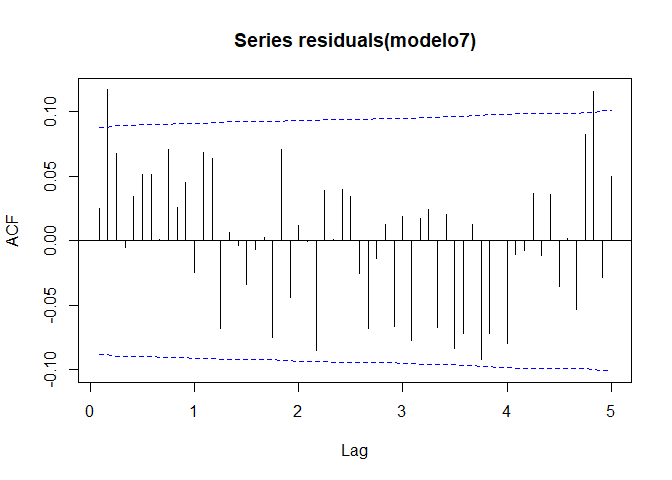<!-- -->

``` r
pacf(residuals(modelo7), lag.max = 60)
```

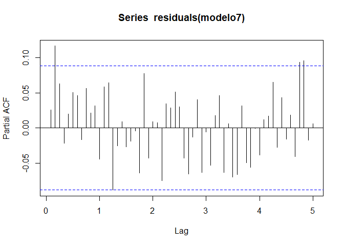<!-- -->

To attempt to eliminate the remaining autocorrelation in the residuals,
the coefficients *SAR(3)* and *SMA(3)* are added to the model, since the
confidence intervals of the coefficients *SAR(2)* and *SMA(2)* include 1
and -1, respectively. The proposed model to adjust is *SARIMA(0,1,2) ×
(3,0,3)\[12\]*.

``` r
modelo8 <- Arima(temperatura, order = c(0,1,2), seasonal = list(order = c(3,0,3), period = 12), method='ML')
summary(modelo8) 
```

    ## Series: temperatura 
    ## ARIMA(0,1,2)(3,0,3)[12] 
    ## 
    ## Coefficients:
    ##           ma1      ma2     sar1    sar2    sar3    sma1     sma2     sma3
    ##       -0.7666  -0.2307  -0.8246  0.8741  0.9504  0.8840  -0.8582  -0.9637
    ## s.e.   0.0415   0.0415   0.0904  0.0469  0.0649  0.1648   0.0654   0.1462
    ## 
    ## sigma^2 = 1.336:  log likelihood = -807.85
    ## AIC=1633.7   AICc=1634.08   BIC=1671.55
    ## 
    ## Training set error measures:
    ##                      ME     RMSE       MAE       MPE     MAPE      MASE
    ## Training set 0.02039294 1.145529 0.9044657 -2.111906 10.07863 0.6901488
    ##                    ACF1
    ## Training set 0.02203212

``` r
acf(residuals(modelo8), lag.max = 60, ci.type='ma')
```

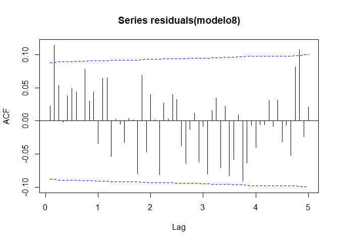<!-- -->

``` r
pacf(residuals(modelo8), lag.max = 60)
```

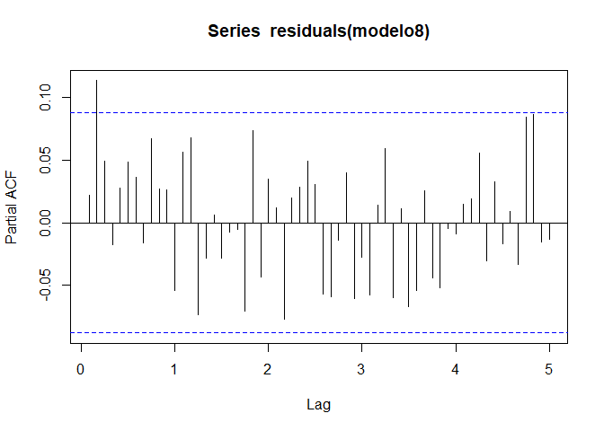<!-- -->

After visualizing the plots of the simple autocorrelation function
(Figure 31) and partial autocorrelation function, it can be concluded
that it is necessary to add the coefficients *MA(3)* and *MA(4)* to the
model, as lag 2 is outside the bands in the ACF plot. Therefore, the
coefficients of the model *SARIMA(0,1,4) × (3,0,3)\[12\]* are estimated.

``` r
modelo9 <- Arima(temperatura, order = c(0,1,4),seasonal = list(order = c(3,0,3), period = 12), method='ML')
summary(modelo9)
```

    ## Series: temperatura 
    ## ARIMA(0,1,4)(3,0,3)[12] 
    ## 
    ## Coefficients:
    ##           ma1      ma2      ma3      ma4     sar1    sar2    sar3    sma1
    ##       -0.7406  -0.1315  -0.0357  -0.0896  -0.6343  0.6867  0.9475  0.6270
    ## s.e.   0.0551   0.0707   0.0589   0.0529   0.3077  0.1891  0.4833  0.3758
    ##          sma2     sma3
    ##       -0.6698  -0.8951
    ## s.e.   0.2400   0.6109
    ## 
    ## sigma^2 = 1.343:  log likelihood = -803.58
    ## AIC=1629.16   AICc=1629.71   BIC=1675.41
    ## 
    ## Training set error measures:
    ##                      ME     RMSE       MAE       MPE     MAPE      MASE
    ## Training set 0.03280527 1.145779 0.9098314 -1.983164 10.09072 0.6942431
    ##                      ACF1
    ## Training set -0.003161792

However, adding two coefficients to the *MA* part of the model causes
the standard errors of the seasonal part to increase drastically. Since
the coefficient *MA(3)* = −0.0357 is almost zero, an attempt is made to
estimate the coefficients of the same model but by fixing *MA(3)* = 0 to
reduce these errors.

``` r
m1 <- Arima(temperatura, order = c(0,1,4),seasonal = list(order = c(3,0,3), period = 12), method='ML', fixed = c(NA, NA, 0, NA, NA, NA, NA, NA, NA, NA))
summary(m1)
```

    ## Series: temperatura 
    ## ARIMA(0,1,4)(3,0,3)[12] 
    ## 
    ## Coefficients:
    ##           ma1      ma2  ma3      ma4     sar1    sar2    sar3    sma1     sma2
    ##       -0.7513  -0.1430    0  -0.1028  -0.8484  0.8975  0.9509  0.9157  -0.8826
    ## s.e.   0.0445   0.0502    0   0.0365   0.0380  0.0563  0.0391  0.0868   0.0641
    ##          sma3
    ##       -0.9870
    ## s.e.   0.0755
    ## 
    ## sigma^2 = 1.308:  log likelihood = -803.85
    ## AIC=1627.7   AICc=1628.15   BIC=1669.74
    ## 
    ## Training set error measures:
    ##                      ME     RMSE       MAE       MPE     MAPE      MASE
    ## Training set 0.02916225 1.132191 0.8926147 -2.017942 9.964032 0.6811059
    ##                    ACF1
    ## Training set 0.00126695

As observed, the standard errors of all coefficients, both for the
regular and seasonal parts, are once again acceptable. Therefore, the
final model will be *SARIMA(0,1,4) × (3,0,3)\[12\]*. In the plots of the
simple autocorrelation function and partial autocorrelation function, it
can be seen that all residuals fall within the bands.

``` r
acf(residuals(m1), lag.max = 60)
```

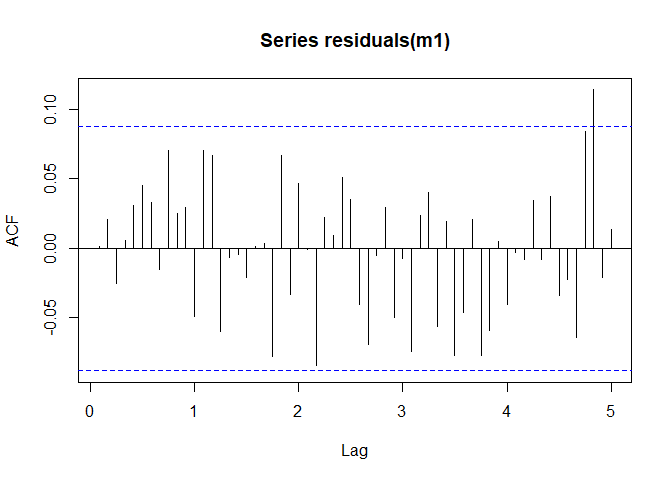<!-- -->

``` r
pacf(residuals(m1), lag.max = 60)
```

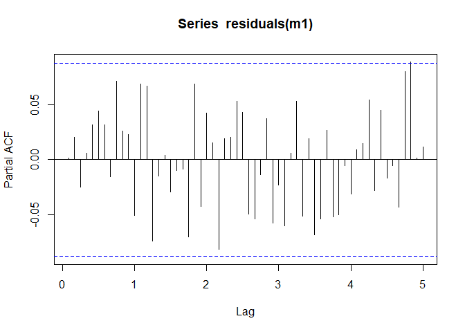<!-- -->
