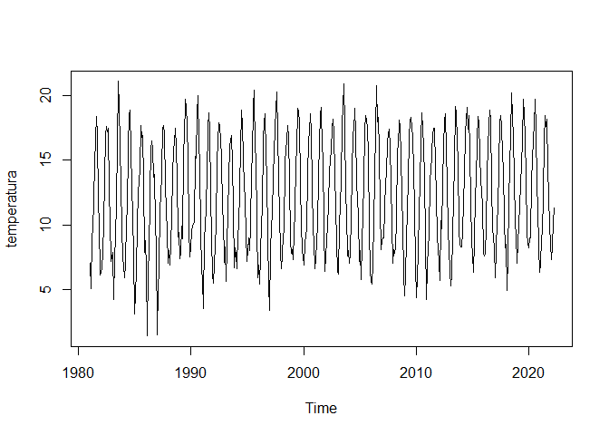
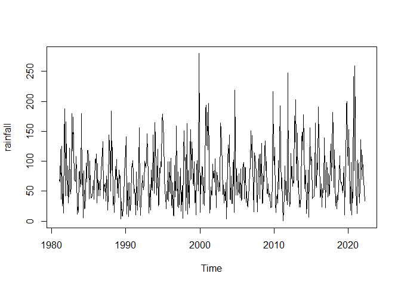
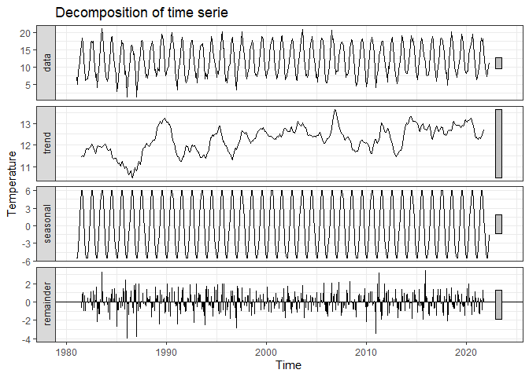
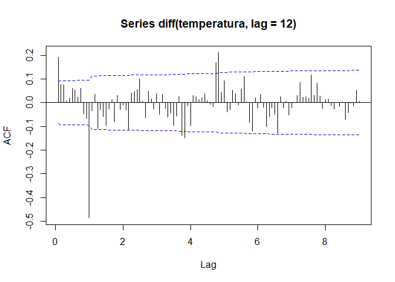
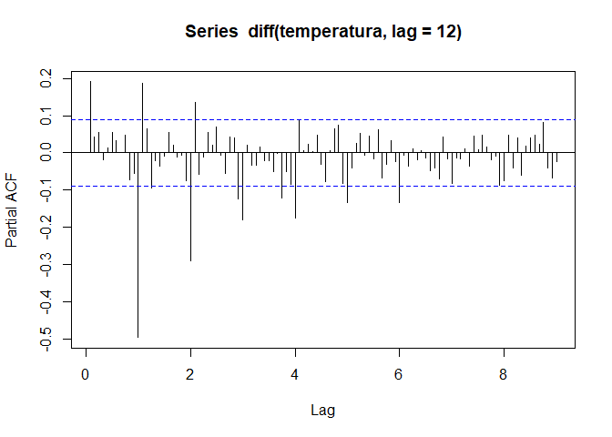

Identification
================

## Introduction

The methodology proposed by Box and Jenkins (1970) is the fundamental
approach for the analysis of time series data, which allows
**identifying** the model, **estimating** its coefficients,
**validating** it, and **predicting** future values. For this purpose,
the *ARIMA(p, d, q)* models, *AutoRegressive Integrated Moving Average*,
are used, where *AR(p)* indicates the autoregressive part, *MA(q)* the
moving average part, and *I(d)* indicates the order of differencing in
the case of non-stationary behavior, meaning its statistical properties
vary over time. A particular case to highlight is the *SARIMA(p, d, q) ×
(P, D, Q)\[s\]* models, which are used to model data with seasonal
behavior (e.g., temperature data).

The
[dataset](https://opendata.gov.je/dataset/monthly-weather-data/resource/c98a3ffe-58aa-4225-a8ad-c19e01edbc5b?inner_span=True)
used corresponds to the measurements of the monthly average temperature
from January 1981 to April 2022 on Jersey Island, provided by the
Government of Jersey. For comparison, the monthly average temperature
data from April 2022 to April 2024, also provided by the Government of
Jersey, are used, even though they are not part of the initial dataset.

Original text (in Spanish) of Master’s Thesis can be found in the same
repository.

## Description of dataset

To illustrate the practical application of the theoretical concepts
defined in the previous section, the climatological dataset from Jersey
Island (officially, the Bailiwick of Jersey), a British Crown dependency
in the English Channel, has been selected. Among all the Channel
Islands, it is the largest, with a population of 103,267 (as of 2021).


The climate is temperate maritime, meaning summers are cool and winters
are mild. The average temperature in summer ranges between 15°C and
20°C, while in winter it ranges between 5°C and 10°C. The island
receives a significant amount of precipitation throughout the year, with
winter months generally being wetter than summer months. Winds are
moderate, and the island rarely experiences extreme temperatures.

The Government of Jersey publishes numerous statistical data on its
website, categorized into various topics: weather, population, health,
inflation, etc. The climatological dataset includes monthly average data
on *air temperature (in °C)*, *sea temperature (in °C)*, *total
precipitation (in millimeters)*, *total sunshine hours*, and *average
air pressure (in millibars)* from January 1981 to April 2022. It is
known that weather-related data are directly linked to the season of the
year, so to predict the subsequent months, the *SARIMA(p, d, q) × (P, D,
Q)\[12\]* model can be used, with *s = 12*, since the previous data are
monthly.

First of all, a brief descriptive analysis of the data is conducted to
detect any anomalies or missing data:

``` r
summary(weather_data)
```

    ##  Month Start Date          Year          Month        Daily air temp (mean)
    ##  Min.   :1981-01-01   Min.   :1981   Min.   : 1.000   Min.   : 1.40        
    ##  1st Qu.:1991-04-23   1st Qu.:1991   1st Qu.: 3.000   1st Qu.: 8.50        
    ##  Median :2001-08-16   Median :2001   Median : 6.000   Median :11.85        
    ##  Mean   :2001-08-16   Mean   :2001   Mean   : 6.468   Mean   :12.22        
    ##  3rd Qu.:2011-12-08   3rd Qu.:2011   3rd Qu.: 9.000   3rd Qu.:16.43        
    ##  Max.   :2022-04-01   Max.   :2022   Max.   :12.000   Max.   :21.10        
    ##                                                                            
    ##  Daily sea temp (mean) Monthly rainfall Monthly sunshine
    ##  Min.   : 7.30         Min.   :  0.20   Min.   : 43.4   
    ##  1st Qu.: 9.60         1st Qu.: 40.88   1st Qu.:106.2   
    ##  Median :12.80         Median : 65.55   Median :192.4   
    ##  Mean   :13.07         Mean   : 74.82   Mean   :185.9   
    ##  3rd Qu.:16.32         3rd Qu.: 99.25   3rd Qu.:259.8   
    ##  Max.   :18.70         Max.   :279.80   Max.   :373.9   
    ##  NA's   :446                            NA's   :370     
    ##  Daily air pressure (mean)
    ##  Min.   :1001             
    ##  1st Qu.:1015             
    ##  Median :1017             
    ##  Mean   :1017             
    ##  3rd Qu.:1019             
    ##  Max.   :1031             
    ##  NA's   :414

The time series for average sea temperature has nearly 90% missing
values (446 out of 496), the data for sunshine hours has 75% missing
values (370 out of 496), and the series corresponding to pressure
measurements has 83% missing values (414 out of 496). The only two
series that do not have missing values are air temperature and
precipitation amounts, and no anomalies were observed in these series.

The two complete series are then visualized:

``` r
temperatura <- ts(data = weather_data$`Daily air temp (mean)`, start =
c(1981, 01), frequency = 12)
plot(temperatura)
```

<!-- -->

``` r
rainfall <- ts(data = weather_data$`Monthly rainfall`, start = c(1981, 01),
frequency = 12)
plot(rainfall)
```

<!-- -->

Comparing the two graphs, it can be assumed that both series have a
constant mean, which is further verified with a statistical test in the
following section. However, the precipitation series shows significant
violations of variance stationarity, which can be confirmed using the
BoxCox.lambda() function for selecting the lambda transformation:

``` r
BoxCox.lambda(rainfall)
```

    ## [1] 0.2747132

The average temperature series, after visual evaluation, does not
exhibit serious issues with non-constant variance, so it is chosen for
the prediction.

## Identification

First, the series is visualized to draw preliminary conclusions about
it. Using the decompose() function, it is possible to break down the
series into three components: seasonal, trend, and random, utilizing
moving averages.

``` r
fit <- decompose(temperatura, type='additive')
autoplot(fit)+
  labs(title = "Decomposition of time serie",
       x = "Time",
       y = "Temperature",
       colour = "Gears")+
  theme_bw()
```

<!-- -->

In this case, no missing or anomalous values are detected, nor any
significant changes in the level of the series. Additionally, a clear
annual seasonal pattern is observed. It is noticeable that since 1981,
the average temperatures have shown an increase, as reflected in the
trend graph, which could be attributed to global climate change. The
final residuals graph provides information about the portion of the
series not explained by the trend or seasonality. The graph suggests
that relatively little variation remains unexplained.

After conducting the preliminary analysis of the series, it is necessary
to verify whether the series is stationary, and if not, to apply
differencing. For this, the Augmented Dickey-Fuller test, one of the
most common tests, is used:

``` r
adfTest(temperatura, lags = 1)
```

    ## Warning in adfTest(temperatura, lags = 1): p-value smaller than printed p-value

    ## 
    ## Title:
    ##  Augmented Dickey-Fuller Test
    ## 
    ## Test Results:
    ##   PARAMETER:
    ##     Lag Order: 1
    ##   STATISTIC:
    ##     Dickey-Fuller: -3.7205
    ##   P VALUE:
    ##     0.01 
    ## 
    ## Description:
    ##  Tue Aug 27 19:34:56 2024 by user: natal

Under the null hypothesis of non-stationarity of the series, the null
hypothesis can be rejected when using just one lag (p-value \< 0.01).
One of the advantages of this test is the ability to consider a larger
number of lags, so it is checked whether the series is stationary at lag
12, given that the data is monthly:

``` r
adfTest(temperatura, lags = 12)
```

    ## 
    ## Title:
    ##  Augmented Dickey-Fuller Test
    ## 
    ## Test Results:
    ##   PARAMETER:
    ##     Lag Order: 12
    ##   STATISTIC:
    ##     Dickey-Fuller: 0.2063
    ##   P VALUE:
    ##     0.6821 
    ## 
    ## Description:
    ##  Tue Aug 27 19:34:56 2024 by user: natal

In this case, there is strong evidence to not reject the null hypothesis
of non-stationarity (p-value = 0.6821). Repeating the test after
differencing the data at lag 12, the null hypothesis of non-stationarity
is rejected because the p-value is less than 0.01:

``` r
adfTest(diff(temperatura, lag = 12), lags = 12)
```

    ## Warning in adfTest(diff(temperatura, lag = 12), lags = 12): p-value smaller
    ## than printed p-value

    ## 
    ## Title:
    ##  Augmented Dickey-Fuller Test
    ## 
    ## Test Results:
    ##   PARAMETER:
    ##     Lag Order: 12
    ##   STATISTIC:
    ##     Dickey-Fuller: -7.8003
    ##   P VALUE:
    ##     0.01 
    ## 
    ## Description:
    ##  Tue Aug 27 19:34:56 2024 by user: natal

To identify the orders of the model, the autocorrelation and partial
autocorrelation plots of the series differenced at lag 12 are used.

``` r
acf(diff(temperatura, lag = 12),lag.max=108,ci.type='ma')
```

<!-- -->

In the ACF (Autocorrelation Function) plot, significant lags are
observed at 1 and 12, while in the PACF (Partial Autocorrelation
Function) plot, significant lags are seen at 1, 12, and 24, suggesting
an annual seasonal behavior of the series. Since neither plot shows a
slow decay, it is again concluded that the series is stationary.

``` r
pacf(diff(temperatura, lag = 12),lag.max=108)
```

<!-- -->

Another way to estimate the number of differences needed for the regular
and seasonal components is by using the ndiffs() and nsdiffs()
functions, respectively:

``` r
ndiffs(temperatura, test = c("adf"))
```

    ## [1] 0

``` r
nsdiffs(temperatura, m = 12)
```

    ## Warning: argument m is deprecated; please set the frequency in the ts object.

    ## [1] 1

The outputs confirm that the regular component does not need
differencing (0 differences), but the seasonal component needs to be
differenced once (1 difference). However, for identifying the mixed
model, it is advisable to use the extended autocorrelation function of
the original series:

``` r
eacf(temperatura, ar.max = 20, ma.max = 20)
```

    ## AR/MA
    ##    0 1 2 3 4 5 6 7 8 9 10 11 12 13 14 15 16 17 18 19 20
    ## 0  x x o x x x x x o x x  x  x  x  o  x  x  x  x  x  o 
    ## 1  x x o x x x x x o x x  x  x  x  o  x  x  x  x  x  o 
    ## 2  x x o o o o o o o o o  o  o  o  x  o  o  o  o  o  x 
    ## 3  x x x o o o o o o o o  o  o  o  x  o  o  o  o  o  x 
    ## 4  x o x x o o x o o o o  o  o  o  x  o  x  o  o  o  x 
    ## 5  x x o o o o x o o o o  o  o  o  x  o  o  o  o  o  x 
    ## 6  x x o o x o o o o o o  o  o  x  o  o  o  o  o  o  o 
    ## 7  x x o o x x o o o o o  o  o  x  o  o  o  o  o  x  o 
    ## 8  x x x x x x x o o o o  o  o  o  o  o  o  o  o  o  o 
    ## 9  x o x x x x o o o o o  o  o  o  x  o  o  o  o  o  o 
    ## 10 x x x o x o o o o x o  o  o  o  o  o  o  o  o  o  o 
    ## 11 x x x o x o x x x o o  o  o  o  o  o  o  o  o  o  o 
    ## 12 x x x x x o x x x o x  x  o  o  o  o  o  o  o  o  o 
    ## 13 o x x x o x o x x o x  x  x  o  o  o  o  o  o  o  o 
    ## 14 o x x x o x o x o o x  x  x  x  o  o  o  o  o  o  o 
    ## 15 x x x o o x x x o o x  x  x  x  o  o  o  o  o  o  o 
    ## 16 x o x x o o x x o o x  x  o  x  o  x  o  o  o  o  o 
    ## 17 x x x o o o x x o o x  x  o  x  o  x  o  o  o  o  o 
    ## 18 x o x x o o x x o x x  x  x  o  o  o  x  o  o  o  o 
    ## 19 x x o x o o x x o o x  x  x  o  o  o  x  o  x  o  o 
    ## 20 o o o x x o x o o o x  o  o  o  o  o  o  o  o  o  o

It is important to remember that one should look for a “triangle of
zeros,” where the upper left vertex indicates the orders *AR(p)* and
*MA(q)*. In this way, you start with the model
*SARIMA(0,0,0)×(0,1,1)\[12\]* and progressively add orders until
reaching the optimal model.

This process involves:

Examining the EACF (Extended Autocorrelation Function) plot: Look for
the triangular shape of zeros in the plot to identify potential values
for p and q for the non-seasonal part of the model.

Starting with a base model: Begin with the simplest seasonal model
*SARIMA(0,0,0)×(0,1,1)\[12\]*, which includes no autoregressive or
moving average components for the non-seasonal part, and one seasonal
difference and one seasonal moving average component.

Iteratively adding orders: Gradually increase the orders *p*, *q*, *P*,
and *Q* based on the EACF results and model diagnostics until the
optimal model is identified.

This approach helps in systematically finding the best-fitting *SARIMA*
model for the data.
